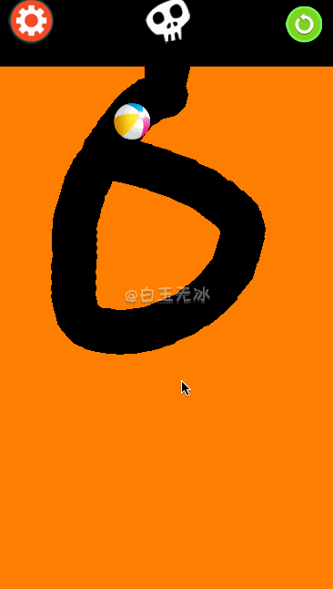

# cocos-creator-examples

cocos creator 一些使用实例 (刚体挖洞/流体效果/shader)

欢迎关注微信公众号 `白玉无冰`


author: http://lamyoung.com/  
B站视频: https://space.bilibili.com/1756070/video  
github: https://github.com/baiyuwubing  
qq 交流群: 859642112  


## [dig_hole](./dig_hole) 

cocos creator v2.3.3  


### 多边形刚体挖洞

Main_poly.fire


图文讲解: https://mp.weixin.qq.com/s/jxKeM2Ah5UHlGTryksdr6Q   

### 链条挖洞 

Main.fire

物理挖洞！涂抹地形! 优化篇来了！图文！视频！源码！通通来了！

优化篇原文:  https://mp.weixin.qq.com/s/4lFv9p346yEg_PSOwN0WKw  
优化篇视频:  https://b23.tv/BV1GV411d7eq  

实现篇:  https://mp.weixin.qq.com/s/Xcf-WPaqiIo-ef6O_IITFg   
实现篇视频讲解  https://b23.tv/BV1jz411z7w1   
在线体验:  http://lamyoung.gitee.io/web/dig_hole/   




## [shader_animation](./shader_animation) 

cocos creator v2.3.3  

### loading 动画

[图文讲解](https://mp.weixin.qq.com/s/QhKzmtpwiQgOzsGPcBHSJQ)   
[视频讲解](https://b23.tv/BV1eg4y1873u)   

  


## [attacked](./attacked) 

[攻击闪白效果，shader入门](http://lamyoung.com/cocos-creator/2020/03/31/ccc-attacked/)  

cocos creator v2.2.2 

  


## [water](./water)

[欢乐水杯(happay glass)的流体实现！](https://mp.weixin.qq.com/s/8Kz0l46YWxcx6cLukAnt9w)  

cocos creator v2.2.2 

 

## [splash](./splash)

[物体随机飞溅运动！ Cocos Creator!](https://mp.weixin.qq.com/s/Qu9Uy55KvUX5sSLt_PTUJQ)  

使用 box-muller 算法 产生正态分布。

cocos creator v2.2.2 


## [snake](./snake)

cocos creator v2.2.2 

[贪吃蛇大作战！蛇移动的思考与实现！](https://mp.weixin.qq.com/s/qZ7CGFRmncxvQZ0Hhs4g5g)  

  

[摇杆控制器！Cocos Creator!](https://mp.weixin.qq.com/s/XbmMXUuOmSL3IvAPp-ThNQ)


## [radar](./radar)

雷达图

[雷达图的一种实现](https://mp.weixin.qq.com/s/hgybmgTHlga0KgHfz1vIfg)  

cocos creator v2.2.2 


## [fractal](./fractal)

分形着色器

[fractal-分形的奥秘-julia-mandelbrot-shader-文章](https://mp.weixin.qq.com/s/OuQaI18LwX3Lw7aRcKjDOw)

cocos creator v2.2.2 


## [gradient](./gradient)

[图像渐变-shader - 文章](https://mp.weixin.qq.com/s/tN2Al3kfo4HwIBGXNjmEDA)

cocos creator v2.2.2 


## [convolutions](./convolutions)

[利用卷积内核实现各种滤镜效果。模糊、锐化、浮雕效果 - 文章](https://mp.weixin.qq.com/s/WAajs8p69X8UJFvNiYuNDA)

cocos creator v2.2.2 


## [flag](./flag)

[飘扬的旗帜 shader - 文章](https://mp.weixin.qq.com/s/E5ZjzIFozvPRIIytmtiuTQ)


cocos creator v2.2.2 


## [meshTexture](./meshTexture)

[mesh 多边形裁剪图片-文章](https://mp.weixin.qq.com/s/r1IEcFXdy4O2Fn4IPs1m_w)


[用鼠标编辑的多边形裁剪-gizmo 插件入门-文章](https://mp.weixin.qq.com/s/YjH9PAWvtgPiDGxp9y7big)


cocos creator v2.2.2 

## [parabola](./parabola)

[新增瞄准线-文章](https://mp.weixin.qq.com/s/Z-7zQuvjIaBzyQRJslH7bQ)  


[平抛高抛发射效果-文章](https://mp.weixin.qq.com/s/5GgL_pONl0bQPxFz4xtjmQ)  


[在线预览](http://lamyoung.gitee.io/web/parabola/)

更新至 cocos creator v2.2.2   


## [aimLine](./aimLine)

[反复横跳的瞄准线-文章](https://mp.weixin.qq.com/s/-zh_4SEd_QMk56T0yE01hQ)


cocos creator v2.0.8 


## [runMan](./runMan)

[蹦跑的小人-文章](https://mp.weixin.qq.com/s/DiB031FORp2JNmWXTdVzmw)  


cocos creator v2.0.8 


## [ktvLabel](./ktvLabel)

[KTV 歌词逐字效果-文章](https://mp.weixin.qq.com/s/os1_7hd3pZX32c128O7QGA)  


cocos creator v2.0.8 

## [shadow](./shadow)

[残影拖尾效果-文章](https://mp.weixin.qq.com/s/iuoyQvCPryajMsfga2IofA)  


cocos creator v2.0.8 

---


```
/*
█████████████████████████████████████
█████████████████████████████████████
████ ▄▄▄▄▄ █▀█ █▄██▀▄ ▄▄██ ▄▄▄▄▄ ████
████ █   █ █▀▀▀█ ▀▄▀▀▀█▄▀█ █   █ ████
████ █▄▄▄█ █▀ █▀▀▀ ▀▄▄ ▄ █ █▄▄▄█ ████
████▄▄▄▄▄▄▄█▄▀ ▀▄█ ▀▄█▄▀ █▄▄▄▄▄▄▄████
████▄▄  ▄▀▄▄ ▄▀▄▀▀▄▄▄ █ █ ▀ ▀▄█▄▀████
████▀ ▄  █▄█▀█▄█▀█  ▀▄ █ ▀ ▄▄██▀█████
████ ▄▀▄▄▀▄ █▄▄█▄ ▀▄▀ ▀ ▀ ▀▀▀▄ █▀████
████▀ ██ ▀▄ ▄██ ▄█▀▄ ██▀ ▀ █▄█▄▀█████
████   ▄██▄▀ █▀▄▀▄▀▄▄▄▄ ▀█▀ ▀▀ █▀████
████ █▄ █ ▄ █▀ █▀▄█▄▄▄▄▀▄▄█▄▄▄▄▀█████
████▄█▄█▄█▄█▀ ▄█▄   ▀▄██ ▄▄▄ ▀   ████
████ ▄▄▄▄▄ █▄██ ▄█▀  ▄   █▄█  ▄▀█████
████ █   █ █ ▄█▄ ▀  ▀▀██ ▄▄▄▄ ▄▀ ████
████ █▄▄▄█ █ ▄▄▀ ▄█▄█▄█▄ ▀▄   ▄ █████
████▄▄▄▄▄▄▄█▄██▄▄██▄▄▄█████▄▄█▄██████
█████████████████████████████████████
█████████████████████████████████████
*/
```